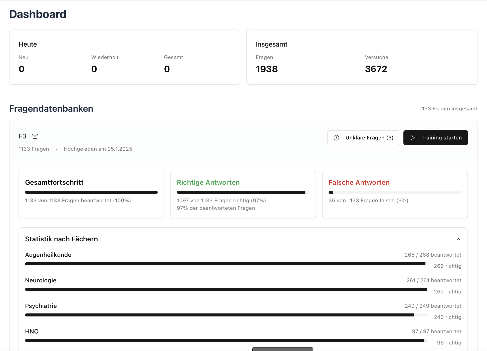
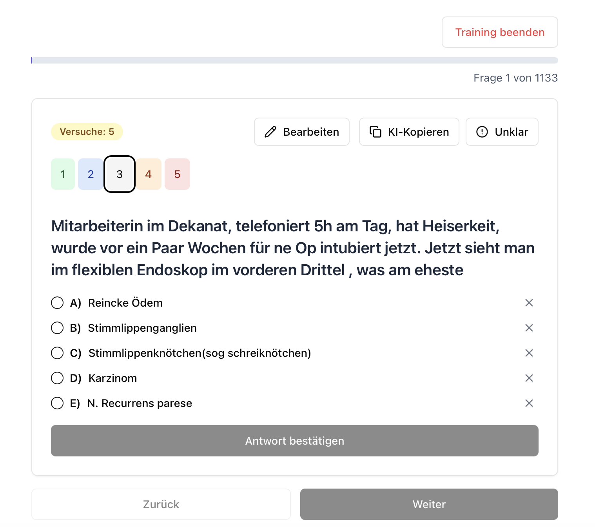

# Altfragen.io

## Overview

Altfragen.io is an intelligent platform for efficient exam preparation using past exam questions. The application allows students to upload their question collections as CSV files and train with an intuitive user interface.





## Features

### 📚 Personal Question Database
- Upload past exam questions as CSV files
- Organize questions by subject and difficulty
- Filter and manage your question collection

### 🧠 Intelligent Learning System
- Smart question selection based on your learning history
- Focus on questions you haven't mastered yet
- Prioritize content based on your performance

### 📊 Progress Tracking
- Detailed statistics on your learning progress
- Track improvement over time
- Identify areas that need more attention

### 🔍 Advanced Filtering
- Filter questions by subject
- Filter by difficulty level
- Only practice questions you've answered incorrectly
- Sort questions by number of attempts
- Random selection for simulating real exam conditions

### 💻 User-Friendly Interface
- Clean, intuitive design
- Responsive layout works on desktop, tablet, and mobile
- Dark mode support
- Automatic progress saving (requires internet connection)

## Getting Started

### Cloud based

- Visit Altfragen.io (Available only in German UI for now)
- Register with E-Mail
- Start learning for free :)

### Self hosted

#### Prerequisites
- Node.js (v16 or higher)
- npm or bun

#### Installation

1. Clone the repository
```bash
git clone https://github.com/jeskokaiser/altfragen-io.git
cd altfragen-io
```

2. Install dependencies
```bash
npm install
# or if you use bun
bun install
```

3. Start the development server
```bash
npm run dev
# or
bun run dev
```

4. Open your browser and navigate to `http://localhost:8080`

## CSV File Format

To upload questions, prepare a CSV file with the following columns:
- Question (text of the question)
- Options A through E (answer choices)
- Correct Answer (letter A-E)
- Comment (optional explanation)
- Subject (category or topic)
- Difficulty (1-5 scale, where 3 is default)

The filename should reflect the exam (e.g., A1_2021-2024) for easy identification in the dashboard.

## Tech Stack

- **Frontend**: React, TypeScript, Tailwind CSS, shadcn/ui
- **Backend**: Supabase (Authentication, Database, Storage)
- **Build Tool**: Vite
- **State Management**: React Query

The code for this project is primarily built using lovable.dev

## License

This program is free software: you can redistribute it and/or modify it under the terms of the GNU General Public License as published by the Free Software Foundation, either version 3 of the License, or (at your option) any later version.

This program is distributed in the hope that it will be useful, but WITHOUT ANY WARRANTY; without even the implied warranty of MERCHANTABILITY or FITNESS FOR A PARTICULAR PURPOSE.  See the GNU General Public License (LICENSE.md file) for more details. 

## Contributing

Contributions are welcome! Please feel free to submit a Pull Request.

1. Fork the repository
2. Create your feature branch (`git checkout -b feature/amazing-feature`)
3. Commit your changes (`git commit -m 'Add some amazing feature'`)
4. Push to the branch (`git push origin feature/amazing-feature`)
5. Open a Pull Request

## Acknowledgments

- Special thanks to all students who provided feedback and testing
- Inspired by the need for a better way to study with past exam questions
