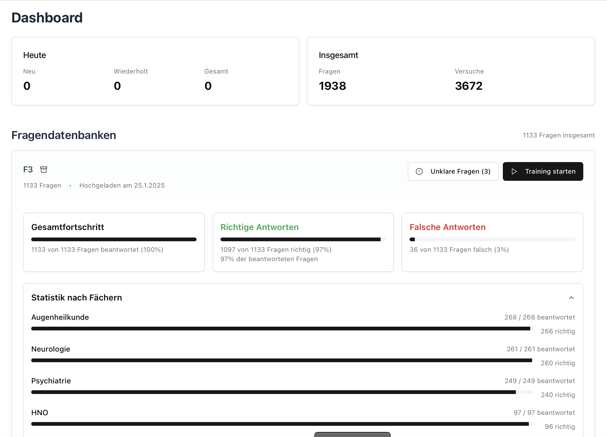
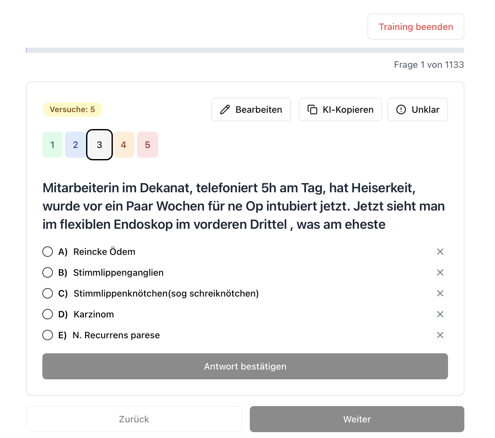

# Altfragen.io

Exam preparation for German medical students, built around past exam questions.
Upload a question collection, train against it, and get AI commentary on the
answers.





## Features

### Question database

- Import questions from CSV, or from PDFs and scans via OCR
- Organise by subject, exam, semester and year
- Keep questions private, share them with your university, or make them public

### Training

- Sessions that remember where you left off, with per-question progress
- Selection weighted towards what you have not mastered yet
- Filter by subject, difficulty, semester, or only questions you got wrong
- Random order for exam-like conditions
- Mark a question unclear to keep it out of rotation

### AI commentary

Several models (ChatGPT, Gemini, Mistral, Perplexity, DeepSeek) explain each
answer option. Generated as a batch pipeline rather than on request, so
commentary is already there when you reach a question.

### Progress and exams

- Statistics over time, per subject and per dataset
- Upcoming exams with linked questions and cohort comparison
- Comments and private notes on any question

### Interface

Responsive, dark mode, German UI. Progress saves automatically and needs a
connection.

## Getting started

Visit [altfragen.io](https://altfragen.io), register with an email address and
start for free.

## CSV format

Prepare a file with these columns:

| Column             | Meaning                     |
| ------------------ | --------------------------- |
| `Frage`            | the question text           |
| `A` – `E`          | the answer options          |
| `Antwort`          | the correct option, `A`–`E` |
| `Kommentar`        | optional explanation        |
| `Fach`             | subject                     |
| `Schwierigkeit`    | 1–5, defaults to 3          |
| `Semester`, `Jahr` | optional                    |

Name the file after the exam, for example `A1_2021-2024`, so it is
recognisable in the dashboard.

## Development

```bash
npm ci        # not npm install -- the lock file is authoritative
npm run dev   # http://localhost:8080
npm run verify   # typecheck + lint + format check + build
```

`npm run verify` is exactly what CI runs, so a green run locally means a green
pull request. Node 20 or newer.

No `.env` is needed: the Supabase URL and publishable key are in
`src/integrations/supabase/client.ts`, and the publishable key is meant to be
public — Row Level Security is what protects the data. Note that the dev server
talks to the production database.

Edge Functions deploy separately from the frontend:

```bash
supabase functions deploy --project-ref <project-ref>
```

### Working on the code

`CLAUDE.md` in the repository root describes the architecture, the domain model
and the parts that carry risk. It is written for AI coding agents — Claude Code
and Cursor both read it — but it is the fastest orientation for a human too.

`docs/modernisation.md` records what has been cleaned up and what is still
outstanding.

**There are no tests yet.** Typecheck and build passing says nothing about
behaviour, so check changes in the browser before opening a pull request.

## Tech stack

React 18, TypeScript, Vite, Tailwind with shadcn/ui, React Router, TanStack
Query. Supabase for Postgres, authentication, storage and Edge Functions.
Stripe for subscriptions and credits. Deployed on Netlify.

## License

This program is free software: you can redistribute it and/or modify it under
the terms of the GNU General Public License as published by the Free Software
Foundation, either version 3 of the License, or (at your option) any later
version.

This program is distributed in the hope that it will be useful, but WITHOUT ANY
WARRANTY; without even the implied warranty of MERCHANTABILITY or FITNESS FOR A
PARTICULAR PURPOSE. See the GNU General Public License (LICENSE.md) for more
details.

## Contributing

Contributions are welcome.

1. Fork the repository
2. Create a feature branch (`git checkout -b feature/amazing-feature`)
3. Make sure `npm run verify` passes
4. Commit, push and open a pull request

## Acknowledgments

- Thanks to all the students who gave feedback and tested
- Inspired by the need for a better way to study with past exam questions
